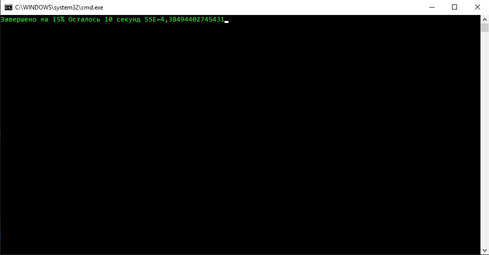
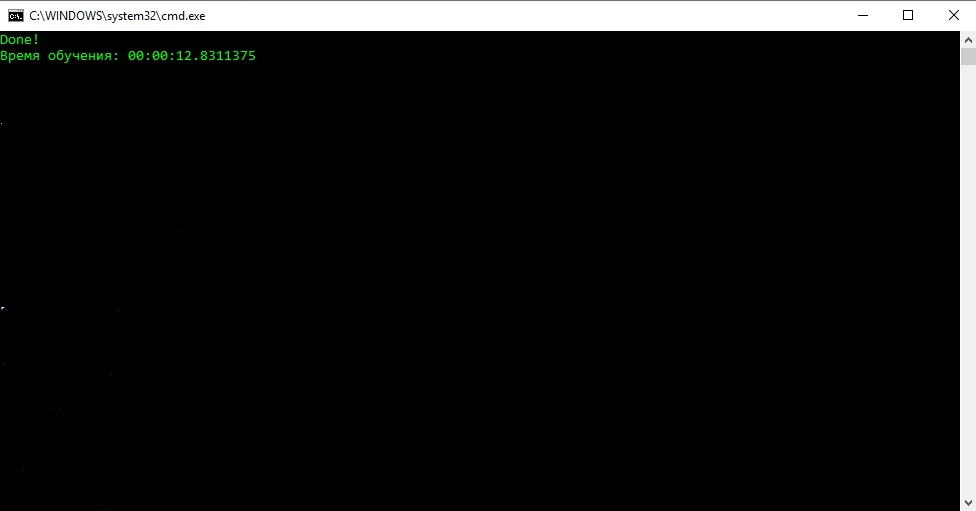
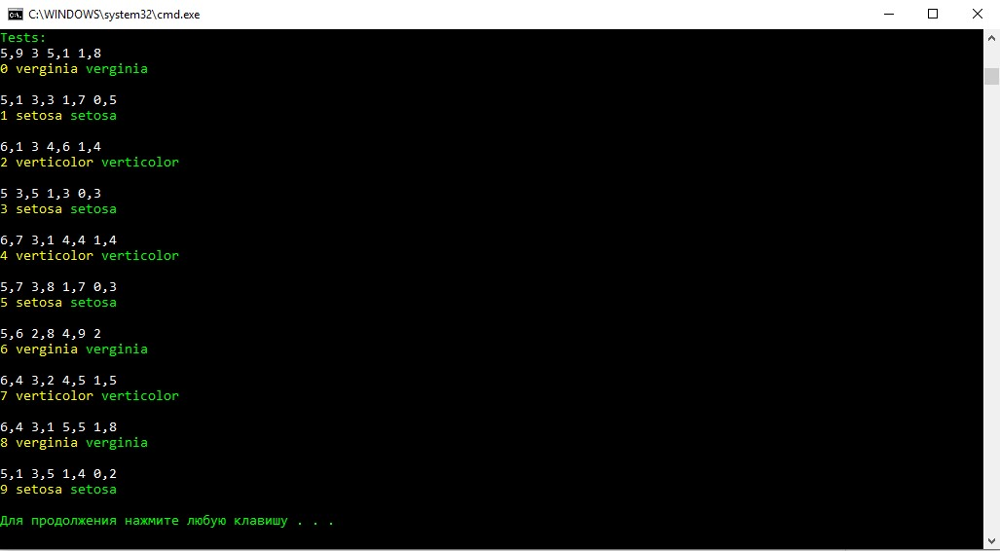

# NeuralNetwork
Простанство имен NeuralNetwork представляет собой библиотеку для работы с искусственными нейронными сетями.

### Инициализация нейронной сети
Класс FeedForwardNet является полносвязной нейронной сетью прямого распространения.
Класс поддерживает слои нейронов с Логистической, тангенсальной и гаусовой функцией активации.
Для этого используется функция AddLayers, где указывается соответсвующая функция активации, либо соответсвующие функции.
Где первый параметр -- это колличество нейронов в слое, второй -- размер входного вектора.
```csharp
net = new FeedForwardNet();
net.AddGaussianLayer(10, 4);
net.AddSigmoidLayer(5, 10);
net.AddTangentialLayer(3, 5);
```
### Обучение
Обучение осуществляет функция Train
```csharp
net.Train(inputs, outputs, LearningRate, epochs, batchSize);
```
inputs -- List<List<double> > Список входов обучающей выборки. <br>
outputs -- List<List<double> > Список выходов обучающей выборки.<br>
LearningRate -- double Коэфициент скорости обучения сети (По умолчанию 0.01).<br>
epochs -- int Колличество эпох.<br>
batchSize -- int размер пакета (По умолчанию 1).<br>

Во время обучения в консоль выводится процент выполнения, приблизительное оставшееяся время работы и сумма квадратов ошибки (SSE).

При завершении выводится время затраченное на обучение.


После обучения сеть сохраняется в виде бинарного файла с расширением .ann.
Класс ANNSerializer позволяет считывать и записывать веса нейронной сети для дальнейшего использования.<br>
Функция
```csharp
static public void WriteNet(LSTMCell net, string netname, string filename)
```
Создает папку с названием netname и записывает сеть net в файл filename.<br>
Функция
```csharp
static public FeedForwardNet ReadNet(string filepath)
```
Принимает путь к файлу .ann и возвращает считанную сеть.
#### Структура .ann файла
```csharp
        /**************************************************
         * Construction of .ann file
         * (4)int32 count of layers
         * for each layer:
         *** (1)FunctionType type of layer
         *** (4)int32 count of neurons
         *** for each neuron:
         ***** (4)int32 size of input vector
         ***** (8 * size)double[] array of weights
         **************************************************/
```
## Пример
Для примера обучим сеть на выборке ирисов Фишшера.<br>
Создадим сеть с тремя слоями 10, 5 и 3 нейронов соответсвенно.<br>
На вход будут подаваться вектор из 4 чисел классифицирующих ирис.<br>
На выходе будет 3 нейрона, каждый будет отвечать за свой сорт ирисов.<br>
Соответсвенно за результат будем брать того нейрона что вернул наибольший результат.<br>
```csharp
const bool newNet = true;
FeedForwardNet net;

if (newNet)
{
	const double LearningRate = 0.1;
	const int epochs = 10000;
	const int batchSize = 1;
	net = new FeedForwardNet();
	net.AddSigmoidLayer(10, 4);
	net.AddSigmoidLayer(5, 10);
	net.AddSigmoidLayer(3, 5);
	net.Train(inputs, outputs, LearningRate, epochs, batchSize);
}
else
{
	net = ANNSerializer.ReadNet(@"first_net/1.ann");
}
```
Считаем выборку перемешаем её случайным образом и разделим на обучающую и тестовую.
```csharp
List<List<double>> inputs = ReadNetIO(@"input4.txt");
List<List<double>> outputs = ReadNetIO(@"output3.txt");

Shuffle(inputs);
Shuffle(outputs);

List<List<double>> testin = new List<List<double>>();
List<List<double>> testout = new List<List<double>>();

for(int i = 1; i < 11; ++i)
{
	testin.Add(inputs[inputs.Count - i]);
	testout.Add(outputs[outputs.Count - i]);
	inputs.RemoveAt(inputs.Count - i);
	outputs.RemoveAt(outputs.Count - i);
}
```
После завершения обучения сеть дает 100% правильных ответов при SSE=2.264678445.<br>
В том числе и на тестовой выборке(Желтым обозначен результат работы сети и зеленым правильный ответ):

